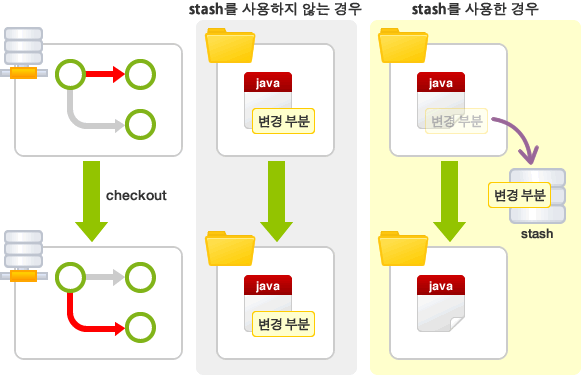

#  Branch

#### * 브랜치란?

- 브랜치란 독립적으로 어떤 작업을 진행하기 위한 개념. 필요에 의해 만들어지는 각각의 브랜치는 다른 브랜치의 영향을 받지 않기 때문에, 여러 작업을 동시에 진행할 수 있음.
- 이렇게 만들어진 브랜치는 다른 브랜치와 병합(Merge)함으로써, 작업한 내용을 다시 새로운 하나의 브랜치로 모을 수 있음.

1. 먼저 메인 브랜치에서 자신의 작업 전용 브랜치를 만듦.
2. 각자 작업을 진행한 후, 작업이 끝난 사람은 메인 브랜치에 자신의 브랜치의 변경 사항을 적용
3. 다른 사람의 작업에 영향을 받지 않고 독립적으로 특정 작업을 수행하고 그 결과를 하나로 모아 나감
4.  이러한 방식으로 작업할 경우 '작업 단위', 즉 브랜치로 그 작업의 기록을 중간 중간에 남기게 되므로 문제가 발생했을 경우 원인이 되는 작업을 찾아내거나 그에 따른 대책을 세우기 쉬워짐.

#### * Master 브랜치

- 저장소를 처음 만들면, Git은 바로 'master'라는 이름의 브랜치를 만듦. 저장소에 새로운 파일을 추가 한다거나 추가한 파일의 내용을 변경하여 그 내용을 저장(커밋, Commit)하는 것은 모두 'master' 라는 이름의 브랜치를 통해 처리할 수 있는 일임.

#### * 통합 브랜치

- 모든 기능이 정상적으로 동작하는 상태'를 의미
- 새로운 기능을 추가해야할 때, 바로 '토픽 브랜치(Topic branch)'를 만들 수 있음.
- 처음에는 보통 통합 브랜치에서 토픽 브랜치를 만들어 냄. ('master' 브랜치를 통합 브랜치로 사용)

#### * 토픽 브랜치

- 토픽 브랜치란, 기능 추가나 버그 수정과 같은 단위 작업을 위한 브랜치.

#### * 브랜치 전환

- '체크아웃(checkout)' 명령어를 실행하여 원하는 브랜치로 전환할 수 있음.
- 체크아웃을 실행하면, 우선 브랜치 안에 있는 마지막 커밋 내용이 작업 트리에 펼쳐짐.
- 브랜치가 전환 되었으므로 이 후에 실행한 커밋은 전환한 브랜치에 추가됨.

#### * HEAD

- 'HEAD' 란 현재 사용 중인 브랜치의 선두 부분을 나타내는 이름.
- 기본적으로는 'master'의 선두 부분을 나타냄. 'HEAD' 를 이동하면, 사용하는 브랜치가 변경됩니다.
  - 커밋을 지정할 때, '~(틸드, 물결기호)'와 '^(캐럿, 삽입기호)'을 사용하여 현재 커밋으로부터 특정 커밋의 위치를 가리킬 수 있음.
  -  이 때 자주 사용하는 것이 'HEAD', '~(틸드)'와 숫자를 'HEAD' 뒤에 붙여 몇 세대 앞의 커밋을 가리킬 수 있음.
  -  '^(캐럿)'은, 브랜치 병합에서 원본이 여럿 있는 경우 몇 번째 원본인지를 지정할 수 있음.

#### <u>* STASH</u>

- 커밋하지 않은 변경 내용이나 새롭게 추가한 파일이 인덱스와 작업 트리에 남아 있는 채로 다른 브랜치로 전환(checkout)하면, 그 변경 내용은 기존 브랜치가 아닌 전환된 브랜치에서 커밋할 수 있음.
- 단, 커밋 가능한 변경 내용 중에 전환된 브랜치에서도 한 차례 변경이 되어 있는 경우에는 체크아웃에 실패할 수 있음. 이 경우 이전 브랜치에서 커밋하지 않은 변경 내용을 커밋하거나, stash 를 이용해 일시적으로 변경 내용을 다른 곳에 저장하여 충돌을 피하게 한 뒤 체크아웃을 해야함.
- stash 란, 파일의 변경 내용을 일시적으로 기록해두는 영역. stash 를 사용하여 작업 트리와 인덱스 내에서 아직 커밋하지 않은 변경을 일시적으로 저장할 수 있음. 이 stash 에 저장된 변경 내용은 나중에 다시 불러와 원래의 브랜치나 다른 브랜치에 커밋할 수 있음.

