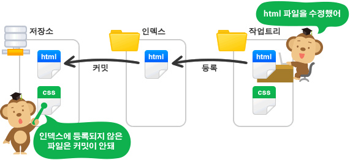
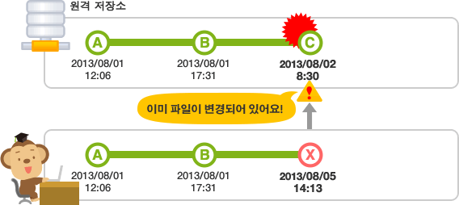

# 1.GIT 기본

### * 원격 저장소와 로컬 저장소

- 원격 저장소(Remote Repository): 파일이 원격 저장소 전용 서버에서 관리되며 여러 사람이 함께 공유하기 위한 저장소입니다.
- 로컬 저장소(Local Repository): 내 PC에 파일이 저장되는 개인 전용 저장소입니다.

### * 커밋

- 파일 및 폴더의 추가/변경 사항을 저장소에 기록하려면 '커밋'이란 버튼을 눌러줘야 합니다.

- 커밋 버튼을 누르면 이전 커밋 상태부터 현재 상태까지의 변경 이력이 기록된 커밋(혹은 리비전)이 만들어집니다.

- 커밋은 아래 그림처럼 시간순으로 저장됩니다. 최근 커밋부터 거슬러 올라가면 과거 변경 이력과 내용을 알 수 있겠죠.

  

### * 작업 트리와 인덱스

- Git의 '커밋' 작업은 '작업 트리'에 있는 변경 내용을 저장소에 바로 기록하는 것이 아니라 그 사이 공간인 '인덱스'에 파일 상태를 기록(stage - 스테이징 한다고 표현하기도 합니다) 하게 되 있음.

### * MERGE

- 내가 끌어온 저장소가 최신 버전이 아닌 경우, 즉 내가 pull 을 실행한 후 다른 사람이 push 를 하여 원격 저장소를 업데이트 해버린 경우 push가 거부됨

- 이런 경우 병합(merge)이라는 작업을 진행하여 다른 사람의 업데이트 이력을 내 저장소에도 갱신 해야합니다. 만약 병합하지 않은 채로 이력을 덮어쓰게 되면 다른 사람이 push 한 업데이트 내역(그림의 커밋C)이 사라져 버리기 때문

### * 충돌 해결하기

- 바로 원격 저장소와 로컬 저장소 양쪽에서 파일의 동일한 부분을 변경한 경우 자동 병합 안됨.

  이 경우 두 변경 내용중 어느 쪽을 저장할 것인지 자동으로 판단 할 수 없기 때문에 충돌이 발생

